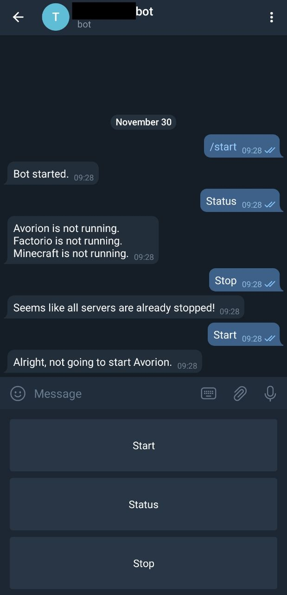

# telegram docker bot

This is a telegram bot which listens for messages and start docker container.

### Use case

If you are running Minecraft or Factorio or TeamSpeak3 container and you don't need them
all the time you might want to stop them in order to save (computing) power, but if you
need them, you don't want to log in to the server and type those commands in.

That's why this bot exists: You can write this bot a message and it start the container.

### What does it do?

You can:
* `Status`: get that status of the managed containers
* `Start`: to start the managed containers (only authorized users)
* `Stop`: to stop the managed containers (only admin)



If a user that is not authorized tries to use the start command, the admin
will get a message that will allow them to either *add*, *ignore* or *ban* the
user.
* `Yes`: adds the user to the authorized users
* `No`: ignores the users request
* `Ban`: adds the user to the banned users

If you add a user to the banned users, the bot will not ask again if you
want to add the user to the authorized users. This will prevent spam.

### Configuration

You have to pass the container the Docker socket.

You have to add the Telegrambot-Key via environment variable.

You have to label the container you want the bot to handle like this
`telegram-bot: "NAMEOFTHECONTAINER"`.

### Sample docker-compose file

```
app:
   image: ausraster/telegram-docker-bot
   container_name: telegram-docker-bot
   environment:
     - ADMIN_ID=0123456789
     - BOT_KEY=0123456789:abcdefghijklmn
   volumes:
     - /var/run/docker.sock:/var/run/docker.sock
     - /folder/on/host/system/data/:/telegram-bot/data/
```

### Add the labels to containers

Add the labels to the docker compose files of the containers like this:
```
    labels:
        telegram-bot: "Minecraft"
```